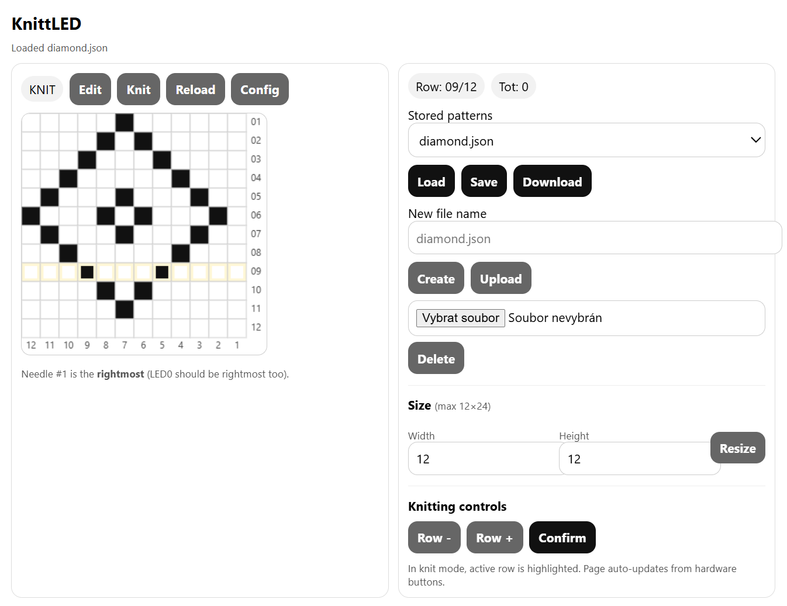

# KnittLED (ESP32)


## Documentation

- Architecture: docs/architecture.md
- Web API: docs/api.md
KnittLED is an ESP32-based helper for hobby knitting machines.  
It hosts a small web UI to edit 1‑bit knitting patterns and displays the active pattern row on a NeoPixel LED strip.
A 128×32 OLED shows the current row and the total number of carriage sensor pulses.



## Features

- **Web UI**
  - Pattern editor (grid up to 12×24)
  - Knitting mode with active-row highlight
  - File management in LittleFS: create / load / save / delete / upload / download
  - Configuration: LED colors, brightness, auto‑advance, warning blink, row counting direction
- **Hardware**
  - NeoPixel strip: **LED0 is the rightmost needle** (needle #1)
  - OLED: shows `Row:xx/yy` and `Tot:n`
  - Buttons: UP / DOWN / CONFIRM
  - Carriage sensor: acts as UP; optional warning blink if row not confirmed

## Pattern file format

There is no universal “standard” file format for knitting punch‑card style patterns used across all hobby systems.
This project uses a small **project-specific JSON** file stored in LittleFS:

```json
{
  "name": "diamond",
  "w": 12,
  "h": 24,
  "pixels": [
    "000001110000",
    "000011111000"
  ]
}
```

- `w` in 1..12
- `h` in 1..24
- `pixels` is an array of strings, each string is exactly `w` chars of `0`/`1`.

## Build & upload (PlatformIO)

1. Open the project in VS Code with PlatformIO installed.
2. Build / Upload as usual.
3. LittleFS is formatted on first boot if needed (see `LittleFS.begin(true)` in `main.cpp`).

## Wi‑Fi provisioning

- Device first tries to connect using stored STA credentials.
- If it fails, it starts an AP: **`KnittLED`**
- Connect to it, open captive portal, select your Wi‑Fi and enter password.
- After success it shows the IP on OLED and reboots into STA mode.

## Doxygen documentation

### Generate docs

Install Doxygen, then from the project root:

```bash
doxygen Doxyfile
```

Output HTML will be in `docs/html`.

### What is documented

- Module overview and architecture
- Public APIs of each module
- Web API endpoints and their behavior
- Data models and persistence

## License

GNU GPL v3